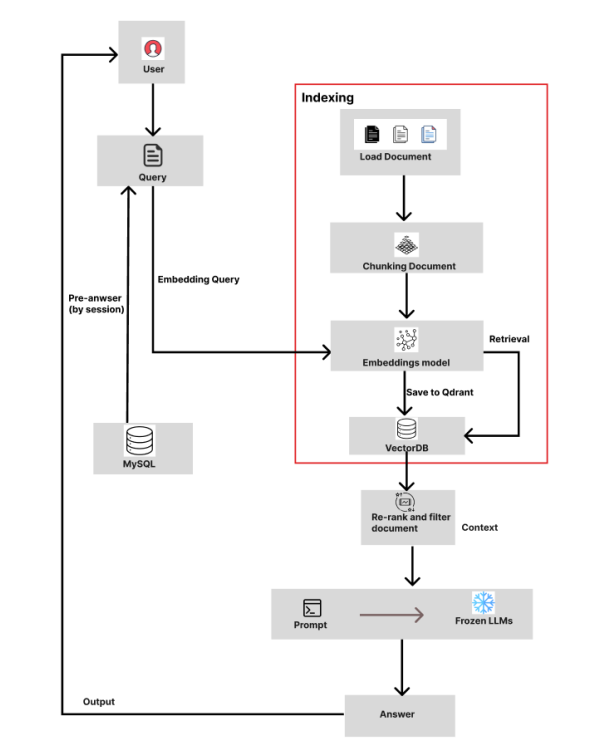

# Multimodal-medical-support-system
AI-powered multimodal medical support chatbot that combines RAG and computer vision for common disease assistance and X-ray image analysis.

**Developed by: TRAN THE ANH**


# Training ViT_MAE_xrays link
https://colab.research.google.com/gist/Theanh130124/586c5199b8fc677133fbfe0aa54830a3/vit_mae_xrays.ipynb

## 1. PROJECT INTRODUCTION
### 1.1 Overview and Context
This study presents the development of an intelligent medical support chatbot designed to assist users with common illnesses. The system integrates Retrieval-Augmented Generation (RAG) to enhance response generation by combining large language models with an external medical knowledge base, enabling accurate and context-aware medical guidance. In addition, the system incorporates computer vision for X-ray image analysis using the Vision Transformer (ViT) with a Masked Autoencoder (MAE) framework for improved feature extraction and classification performance. To improve efficiency, a prompt-caching technique is applied to reduce response time and computational costs. Experimental results show that the proposed system achieves an accuracy of up to 90%.


### 1.2 Requirements and Goals

Given this reality, the project demands a technological solution to help people access accurate and safe medical information.

The specific requirement is to develop an Artificial Intelligence (AI) application capable of:

1.  Image recognition of the X-RAYS
2.  Symptom analysis described by the user.
3.  Providing reliable preliminary advice.


## 2. TECHNOLOGY STACK

The chatbot system leverages several advanced technologies:

| Technology                               | Role in the System                                                                                                                                                                                    |
| :--------------------------------------- | :---------------------------------------------------------------------------------------------------------------------------------------------------------------------------------------------------- |
| **Flask**                                | Serves as the web framework for deploying the application and handling communication between users and the AI modules.                                                                                |
| **RAG (Retrieval-Augmented Generation)** | Integrated with LangChain to enhance Natural Language Processing (NLP) by retrieving relevant medical knowledge and generating accurate, context-aware responses.                                     |
| **ViT + MAE**                            | Used for chest X-ray image analysis. The MAE model performs self-supervised pretraining to learn robust image representations, while Vision Transformer (ViT) performs the final classification task. |
| **Redis**                                | Implements prompt caching to store previously processed prompts, reducing response time and computational costs during repeated queries.                                                              |
| **MySQL**                                | Stores user information and chat history, supporting system management and personalized interactions.                                                                                                 |
| **Qdrant**                               | Serves as the vector database for storing embeddings and enabling efficient semantic retrieval within the RAG pipeline.                                                                               |
| **Selenium**                             | Used to automatically collect medical knowledge data from reputable healthcare websites to build the knowledge base.                                                                                  |

## 3. SYSTEM ARCHITECTURE AND PERFORMANCE

### 3.1 Architecture

The system is designed with two primary processing flows:

1.  **Image Processing Flow (ViT_MAE):** Analyzes user-uploaded  images X-rays to identify pathological features.
2.  **Text Processing Flow (RAG):** Analyzes user-described symptoms and retrieves information from the knowledge base.

The diagram below illustrates the RAG architecture used for the text processing flow:


_(Note: The diagram uses "Pinecone" as an example VectorDB. This project uses "Qdrant" in the equivalent role.)_


### 3.2 Key Results and Performance

- **Training ViT_MAE_xrays Accuracy:** The model achieved **93% accuracy**.  
  The training notebook can be found [here](https://colab.research.google.com/gist/Theanh130124/586c5199b8fc677133fbfe0aa54830a3/vit_mae_xrays.ipynb).
[- **Dataset:** model was trained on a dataset containing **7,340 images** covering **14 disease labels**.](https://huggingface.co/datasets/tta1301/nih-chest-xray-small)

### 3.3 Product Interfaces

The developed graphical user interfaces (GUIs) include:

1.  Login and Registration Interface
2.  Homepage Interface
3.  Chatbot Interface
4.  Contribution Page Interface

_(Recommended: Insert screenshots of your application here, e.g., `[screenshot_chat.png]`)_

## 4. GETTING STARTED

This guide will get you a copy of the project up and running on your local machine for development and testing purposes.

### 4.1 Prerequisites

Ensure you have the following software installed:

- Python `[e.g., 3.10+]`
- MySQL Server `[e.g., 8.0+]`
- Qdrant (running as a service or Docker container)
- Git

### 4.2 Installation

1.  **Clone the repository:**

    ```bash
    git clone [your-repository-url.git]
    cd [your-project-directory]
    ```

2.  **Create and activate a virtual environment (Recommended):**

    ```bash
    # For macOS/Linux
    python3 -m venv venv
    source venv/bin/activate

    # For Windows
    python -m venv venv
    .\venv\Scripts\activate
    ```

3.  **Install the required packages:**
    ```bash
    pip install -r requirements.txt
    ```

### 4.3 Configuration

1.  **Database Setup:**

    - Access your MySQL server and create a new database for the project.
    - Example: `CREATE DATABASE skinbox_db;`

2.  **Environment Variables:**

    - Create a `.env` file in the root directory of the project.
    - Copy the contents from `.env.example` (if it exists) or add the necessary variables.

    **Example `.env` file:**

    ```ini
    # Flask Configuration
    FLASK_APP=app.py
    FLASK_ENV=development
    SECRET_KEY=[your-very-long-random-secret-key]

    # Database Configuration
    DB_HOST=localhost
    DB_USER=root
    DB_PASSWORD=[your-mysql-password]
    DB_NAME=skinbox_db

    # Qdrant Configuration
    QDRANT_HOST=localhost
    QDRANT_PORT=6333
    ```

### 4.4 Running the Application

1.  **Run the Flask web server:**

    ```bash
    flask run
    ```

    Or:

    ```bash
    python app.py
    ```

    The application will be accessible at `http://127.0.0.1:5000`.

2.  **Run other scripts (if applicable):**
    - To run the Selenium data crawler:
      ```bash
      python run_selenium_crawler.py
      ```
    - To retrain the CNN model:
      ```bash
      python train_model.py
      ```


## 5. PRODUCT IMAGES

1.  **LOGIN AND REGISTER:**

    

    

2.  **HOME PAGE:**
    
    
    


   
5.  **GG MAP:**
   
